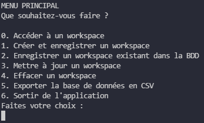
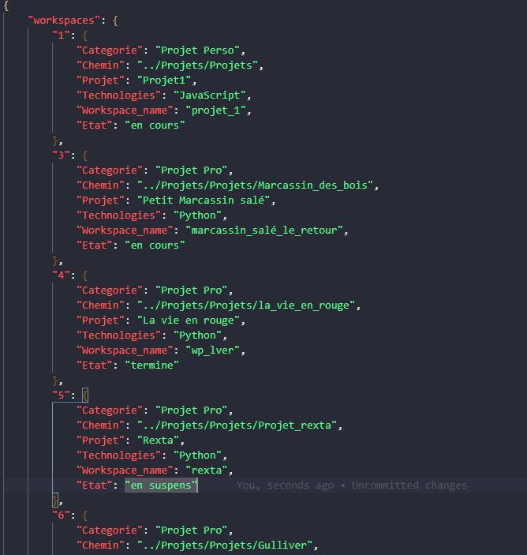
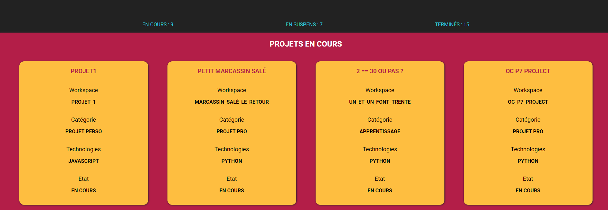

# Projet MyFML
## Les concepts expliqués
[la classe tinydb](#la-classe-tinydb)

## Sommaire

Chapitre 1 [L'idée](#idée)
>
Chapitre 2 [Possibilités](#possibilités)
>
Chapitre 3 [Améliorations possibles](#aller-plus-loin)
>
Chapitre 4 [La structure](#la-structure)
>
Chapitre 5 [Le code](#le-code)
>
Chapitre 6 [Documentation](#documentation-et-utilisation)
>
chapitre 7 [Visualier les workspaces](#visualisation)

---
[top](#sommaire)

## Idée

J'ai crée ce projet pour plusieurs raisons.
- Lors de mes transferts de sauvegarde vers mes disques durs externes ou dans le cloud,
  comme mes support de destination contenaient d'autres dossiers non attenants aux fichiers
  à transférer, je devais donc parcourir plusieurs dossiers et cela pouvait certaines fois me
  faire perdre la tête.
- Je suis en cours de formation professionnelle et personnelle, et de surcroit, dans le monde de la programmation.
  Du coup, j'ai beaucoup de choses à revoir, travailler, présenter, chercher etc. et cela commence à devenir un
  casse tête pour ranger mes dossier de manière optimale.
- Je dois réaliser plusieurs projets professionnels, m'entrainer selon ce que j'apprends, effectuer des actions
  chaque jours (sport, anglais, maths) et finalement m'auto former sur des tutoriels eux aussi classés.

Mon projet permet donc 
- d'ouvrir un workspace, directement dans mon éditeur de code VSCode.
Cela m'évite de chercher le dossier cliquer droit dessus et ouvrir dans vscode
- de bénéficier d'une structure facile d'accès et contenant tous les sous dossiers nécessaires à un classement le plus exhaustif possible.
- de lancer le fichier html depuis l' éditeur de code s'il le permet afin d'avoir un visuel sur les projets en cours, en suspens, ou terminés. En revanche, le CRUD s'effectue côté console, en  lançant python main.py.

Là où ce projet est efficace, c'est que j'ai aussi des workspaces contenant des formations sous forme de projets à réaliser indépendamment de ceux de ma formation actuelle. J'ai aussi des projets personnels en cours dont celui-ci, pour lesquels j'ai aussi crée des workspaces. Tous ces workspaces sont situés dans des dossiers ou sous-dossiers différents. Je peux être amené à travailler sur 2 à trois projets différents par jour, selon mon emploi du temps. Ce qui peut au bout d'un certain temps et d'un certain nombre de workspaces, devenir un casse_tête en termes de recherches.

Finalement tout cela, réduit considérablement mon stress lié à la recherche de dossiers dans tous les sens, me permet de sereinement et rapidement switcher d'un workspace à l'autre, et me libère d'une raison de procrastiner ou d' abandonner parmi tant d'autres.

Je pense que la V2 sera développée avec Django, cela permettrait plus de possibilités côté Python et toujours la gestion du Front avec JS, HTML, SCSS...

---
[top](#sommaire)

## Possibilités

Enregistrer un nouveau chemin (path) de workspace dans une base de données et créer le dossier en même temps
Accéder à un des multiples chemins de workspace enregistrés dans la base de données
Ouvrir un workspace sélectionné dans une fenêtre vscode
Les nouveaux dossiers crées manuellement dans les chemins Apprentissages ou Projets sont automatiquement ajoutés à la BDD
au lancement du programme. <3

---
[top](#sommaire)

## Aller plus loin

Maintenant que ma structure MVC est faite, si je veux améliorer mon code, mes classes sont déjà faites, et le comportement restera toujours le même. Je vais pouvoir ajouter des classes, par exemple, ici, j'ai une classe workspaces
qui permet d'ouvrir un dossier de travail dans vscode. 
Je peux tout à fait ouvrir directement des dossiers dans windows, des fichiers md etc... avec ce programme.

---
[top](#sommaire)

## La structure

```json
{ 
    "MYFML_APP" : 
    [
        {
            "assets": 
            [
                {
                    "css": "main.css",
                    "docs": "",
                    "images": 
                    [
                        "choix.PNG", 
                        "database.PNG",
                        "..."
                    ],
                    "js": 
                    [
                        "main.js", 
                        "md_files.js", 
                        "workspace.js"
                    ],
                    "scss": "main.scss",
                }
            ],
            "python_local_json_API": [
                {
                    "app": [
                        {
                            "controllers": "controller.py",
                            "data": "workspaces.json",
                            "models": 
                            [
                                "folderModel.py",
                                "mdFileModel.py",
                                "workspaceModel.py"
                            ],
                            "views": "mainView.py"

                        }
                    ] 
                }
            ]
        }
    ]
}
```

**Fichier README.md**
> Ce fichier correspond à celui que vous êtes en train de parcourir

**Fichier main.py**
> Ce fichier est lié au fichier controller.py situé dans 
> "python_local_json_API/app/controllers". Cela est pratique car il nous permet de lancer le projet sans avoir à accéder à tous les fichiers de scripts. Du coup, pour lancer le projet, il suffit juste de taper dans la console "py main.py"

**Fichier index.html**
> Il s'agit du visuel des workspaces présents dans la BDD. Je l'ai laissé ici, car c'est plus pratique pour lancer ce fichier dans le navigateur avec "live server", sans être obligé de parcourir les dossiers. C'est beaucoup plus propre qu'une vue des workspaces dans un tableau Pandas ou Numpy.

**Fichier fetch_workspace_data.js**
> Ce fichier est un fichier JavaScript attenant au index.html. Ce fichier fait l'intermédiaire entre la base de données "workspaces.json" contenu dans "python_local_json_API/app/data" et le fichier "main.js" contenu dans "assets/js". J'ai mis ce fichier à la base du projet, car je rencontrais des problèmes pour récupérer des donnés de la bdd à partir du dossier assets/js. Du coup, main.js contient le squelette des actions qui seront faites sur les données récupérées, et le fichier fetch_workspaces_data.js se contente d'appliquer ces actions sur les données récupérées dans la BDD.

**Dossier python_local_json_API**
> Ce dossier contient le dossier "app", qui lui même contient la structure MVC du projet dans sa version Python:
>> **Le dossier app contient:**
>>> **Le dossier controllers**
>>> Contient le fichier controller.py, qui lance le projet
>>> **Le dossier data**
>>> Contient le fichier workspaces.json => la database format JSON
>>> **Le dossier models**
>>> Contient les modèles d'un dossier, d'un fichier .md, d'un workspace
>>> **Le dossier views**
>>> Contient un fichier mainView.py qui controlle les affichages dans la console

**Dossier assets**
> Ce dossier contient les dossiers "css, docs, images, js, scss", qui contiennent toute la structure attenante au fichier index.html, et nécessaire à l'affichage des éléments de la base de données dans le navigateur.

---
[top](#sommaire)

## Le code

**Dossier models**

```python
    # La classe Workspace du fichier workspaceModel.py

    class Workspace:
    """
    La classe workspace, représente les informations définissant un workspace
    """

    ''' Un workspace possède :
        category => une catégorie (apprentissages, projets)
        technologies => les technologies utilisées (JavaScript, Python...)
        path => le chemin de son dossier parent qui contient le workspace
        ws => le nom de son dossier
        pathname => son nom utilisé pour l'affichage
        state = > son état (en cours, terminé, en suspens)
    '''
    def __init__(self, category, technologies, path, ws, pathname=None, state=None):
        self.category = category
        self.technologies = technologies
        self.path = path
        self.ws = ws
        self.pathname = pathname
        self.state = state

    def record_workspace_path(self, database_table):
        database_table.insert(
            {
                "Projet": self.pathname,
                "Categorie": self.category,
                "Technologies": self.technologies,
                "Chemin": self.path.replace("\\", "/"),
                "Workspace_name": self.ws,
                "Etat": self.state,
            }
        )
```

**Dossier controllers**

``` python
    # La classe controller du fichier controller.py
    ''' 
    Dans le fichier controller.py, on importe directement les classes View et Model on peut aussi importer une base de données
    intallée au préalable avant. Selon la base de données utilisée, un dossier data contiendra 
    le résultat, soit dans un fichier JSON au autres ... Il est important de l'importer dans
    le fichier controller.py, car c'est le controller qui gérera toutes les interactions
    entre ses trois collègues data, view et model.
    '''
    from model import Model # on peut le faire pour chaque model différent ou *
    from view import View
    from tinydb import TinyDB, Query

    db = TinyDB("workspaces.json", sort_keys=True, indent=4, separators=(",", ": "))
    workspaces_table = db.table("workspaces")
    User = Query()
```

---
---
[top](#les-concepts-expliqués)

## Les concepts

### La classe tinydb

```python
from tinydb import TinyDB, Query # importation des modules de la librairie

 '''
    Pour ce qui est de la bdd tinydb. 'sort_keys' permet de visualier la base de données
    en mode cascade et non linéaire en lui attribuant 'True'. "workspaces.json" est 
    le nom du fichier .json qui accueille les données. "indent" permet de visualiser 
    des données indentées en fonction de leur enchevêtrement. En lui attribuant 4,
    on dit que chaque élément et indenté de 4 par rapport à son élément parent.
    'separators' nous dit que chaque paire clé/valeur sera séparée par : et un espace
    puis, que chacune de ces paires sera placée à l'une en dessous de l'autre, et 
    seront délimitées par une virgule.
    '''
    db = TinyDB("workspaces.json", sort_keys=True, indent=4, separators=(",", ": "))
    workspaces_table = db.table("workspaces") # définir le nom de la table
    User = Query() # définir tous les items de clé/valeurs "les requêtes"

    `doc_id`  
    ''' 
    chaque nom de clé doit obligatoirement
    être un seul mot ou séparé par des underscores ou tes tirets:
    représente le numéro de l'item en question et on peut les afficher comme ceci:
    '''
    for item in workspaces_table:
        print(item.doc_id)
    # 1
    # 2
    # ...

    '''
    On peut aussi grâce à une boucle, représenter certains éléments de chaque item
    contenu dans une table de tinydb, de la manière que l'on veut, comme ceci:
    '''
    for item in workspaces_table:
        print(item.doc_id + ' -- ' + item["mot_de_passe"] + ' -- ' + item["nom"] + ...)

```

---
[top](#sommaire)

## Documentation et utilisation

Je viens de créer la dernière fonctionnalité pour cette version du projet

**auto_search_and_record_new_folders**
Cette nouvelle fonction au lancement de main.py, utilise un algorithme qui parcours 
les dossiers Apprentissages et Projets à la recherche de workspaces ne figurant pas dans
la base de données. Si un dossier entre dans ce critère, l'algorithme crée un workspace
et toutes ses informations, à partir du nom du dossier concerné. <3 

Lorsque vous arrivez au menu principal, vous avez plusieurs possibilités:

**Accéder à un WorkSpace**
Ce choix, vous affiche les espaces de travail existants. Chaque espace de travail possède
un identifiant, un état, un nom de projet, une catégorie, et les technologies utilisées. 
Pour accéder à un d'entre eux, il vous suffit juste de fournir son identifiant.
finalement, votre workspace s'ouvre directement avec votre éditeur de code par défaut.

**Créer et enregistrer un WorkSpace**
Ce choix vous permet non seulement d'ajouter un Projet et son Workspace à la base de données,
mais aussi de créer le dossier sur votre ordinateur physiquement selon le chemin spécifié.
Comment spécifier ce chemin ? 
Tout d'abord, ce choix va vous demander des informations.
> ***La catégorie du Projet*** (Il faut taper la catégorie comme proposée avec les majuscules)
> Afin de spécifier si le projet est réalisé soit pour vous, soit dans un cadre professionnel, soit dans une optique d'entrainement ou apprentissage.
> 
> ***Les technologies utilisées*** (renseignez chaque techno séparées par une virgule)
> ***Le chemin du projet*** (Les chemins sont déjà crées, il vous suffit de taper en minuscule l'une des deux propositions)
> Le chemin du projet correspond au dossier qui va contenir tous les projets liés, soit à l'apprentissage soit à la réalisation de side project / projets pros
> 
> ***Le nom du WorkSpace*** (Votre espace de travail. "Privilégiez_un_nom_avec_les_underscores")
> Chaque WorkSpace est enregistré soit dans le chemin de dossiers Projet ou Apprentissage, selon qu'il s'agisse d'un apprentissage (tutos, cours, entrainement etc.) ou d'un projet réalisé par nous de A à Z (Side project ou Projet Professionnel)
> 
> ***Le nom du Projet*** (Essayez de taper un nom de projet sans trop dépasser les 12 lettres)
> C'est le nom de Projet qui sera affiché dans le tableau lorsque vous souhaiterez accéder à un WorkSpace, le modifier ou l'effacer.
> 
> ***L' état d'avancement du projet'*** (Renseignez soit 'en cours', 'termine' ou 'en suspens' en minuscules)
>> *en cours signifie que vous travaillez de manière régulière sur votre projet*
>
>> *teminé signifie que vous avez terminé votre projet et que vous ne reviendrez pas dessus*
>
>> *En suspens correspond à une sorte de backlog, dans lequel soit vos projets son à l'état d'idées ou soit en attente de reprise pour une question de priorité. par exemple, si vous avez trop de projets Professionnels à réaliser ou qu'un side project vous prend trop de temps.*

**Enregistrer un WorkSpace existant**
Ce choix vous permet d'enregistrer dans la base de données, les informations d'un workspace déjà crée physiquement sur votre ordinateur. Cependant, pour éviter d'aller chercher partout dans votre ordinateur lors de la sauvegarde de vos projets sur un disque du externe ou sur le cloud, enregistrez bien vos workspaces soit dans le dossier Apprentissage ou Projet. Ce choix vous permet d'enregistrer des WorkSpaces en temps que sous-dossier de projet. Les étapes ici sont les mêmes que pour créer un workspace à une exception près. Vous devez renseigner physiquement le chemin du Projet ou sous projet dans lequel situé votre WorkSpace. pour cela, ouvrez le dossier du Projet ou sous projet, copiez_collez l'adresse de votre barre de navigation dans l'invite de commande. pour les autres renseignements, cela se passe comme lors de la création de WorkSpace.

**Mettre à jour un WorkSpace**
Ce choix vous permet de mettre à jour les informations d'un WorkSpace.
Premièrement vous devez renseigner l'identifiant ou l'ID du projet concerné
Puis de choisir le renseignement que vous souhaitez mettre à jour (changer quoi).
Vous devez impérativement entrer l'une des commandes proposées, avec les majuscules et les underscores bien évidemment.

**Effacer un WorkSpace**
Comme son intitulé l'indique vous pourrez effacer un workspace de la base de données, ainsi que son dossier physique présent sur l'ordinateur en choisissant renseignant simplement son identifiant ou ID.

**Exporter la base de données en CSV**
Ce choix peut être très utile pour faire des statistiques ou être renseigné sur le nombre de dossiers de travail présents sur l'ordinateur etc...

**Sortir de l'application**
Je ne pense pas qu'il soit nécessaire de vous l'expliquer, quoique !!?... ;)

---
[top](#sommaire)
## Visualisation

Vous pouvez accéder à un rendu visuel de vos WorkSpaces via le navigateur internet.
Dans votre editeur de texte, il vous suffit de cliquer sur l'index html, et l'ouvrir avec live server.
Si vous n'avez pas l'option ouvrir avec live server, je vous laisse vous documenter selon l'éditeur de
code que vous utilisez. Néanmoins, vous avez la possibité de simplement installer une extension si vous utilisez VS code.

---
## Demo

**Make a choice**



**Database JSON**



**Display in Browser**

